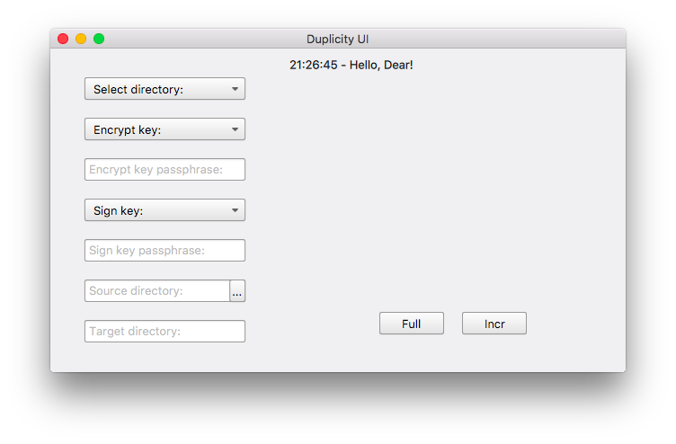
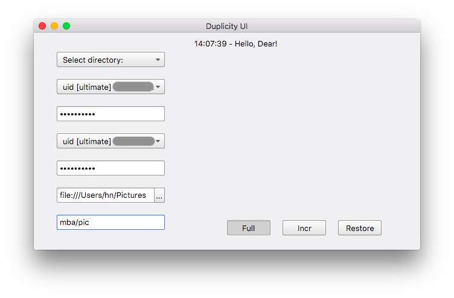
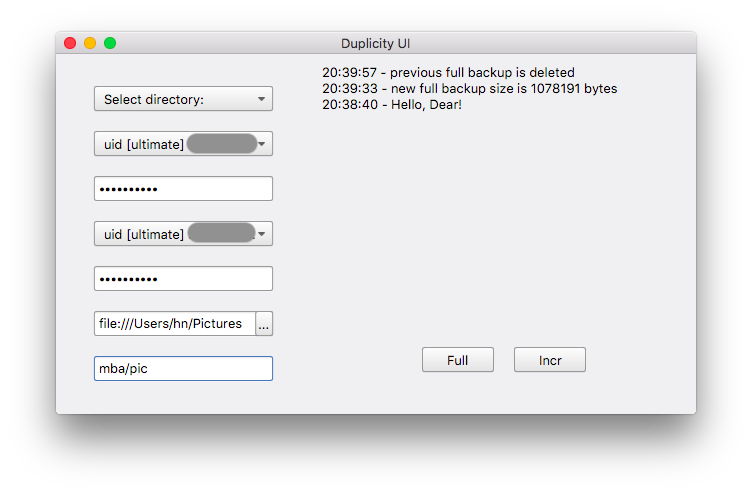
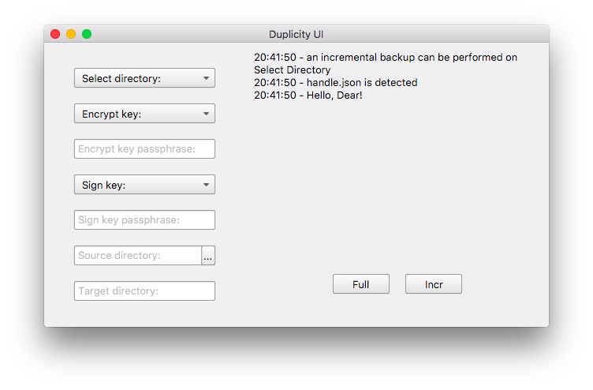
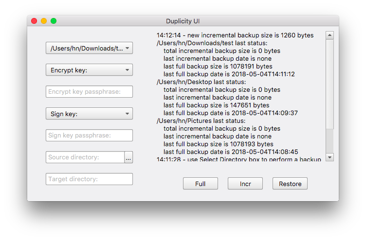

# Duplicity-UI

## Intro

Duplicity-UI is a small UI application with less than 1MB size based on Qt Quick, used by myself for doing backup to Google Drive with Duplicity. The application itself doesn't include **duplicity**, **pydrive** or **GPG** so make sure these applications are already installed. You can check this [post](https://redplus.me/post/using-duplicity-with-google-drive-for-backup-on-macos/) for how to install pydrive and duplicity on macOS.

The program will store input information to a **handle.json** file in the current working directory for later use so you don't need to input once again. Because the information is stored in plain text without encryption, you may **NOT** want to use your current gpg keys for encryption and signing, even though GPG key's passphrase is encoded before writing to file.

Whenever a full backup is performed, all backup files before this full backup will be deleted. Multiple folders are supported and you can use **Select directory:** box to show the corresponding last backup status.

This program is only tested on macOS 10.13.4 with [LLVM](https://llvm.org/) 6.0, [Boost](https://www.boost.org/) 1.67, [Qt](https://www.qt.io/) 5.10.1, [Crypto++](https://www.cryptopp.com/) 7.0.0, [duplicity](http://duplicity.nongnu.org/) 0.7.17 and [PyDrive](https://github.com/gsuitedevs/PyDrive) 1.2.1 and depends on Crypto++, Boost and Qt libraries only. It should work on WINDOWS as well but not tested.

## TODO: Asynchronous backup process for different folders

## Screenshots








## FAQ

1. **What does "Class FIFinderSyncExtensionHost is implemented in both /System/Library/PrivateFrameworks/FinderKit.framework/Versions/A/FinderKit (0x7fffb4de2c90) and /System/Library/PrivateFrameworks/FileProvider.framework/OverrideBundles/FinderSyncCollaborationFileProviderOverride.bundle/Contents/MacOS/FinderSyncCollaborationFileProviderOverride (0x113dedcd8). One of the two will be used. Which one is undefined." mean?**

As far as I know it's a macOS High Sierra issue, but it doesn't impact on the application.

2. **Why does not this application have a progress bar?**

Duplicity will do a dry run to have **--progress** enabled. It will waste a lot of time if the backup size is quite large.

## License

```
This program is free software: you can redistribute it and/or modify
it under the terms of the GNU General Public License as published by
the Free Software Foundation, either version 3 of the License, or
(at your option) any later version.

This program is distributed in the hope that it will be useful,
but WITHOUT ANY WARRANTY; without even the implied warranty of
MERCHANTABILITY or FITNESS FOR A PARTICULAR PURPOSE.  See the
GNU General Public License for more details.

You should have received a copy of the GNU General Public License
along with this program. If not, see <http://www.gnu.org/licenses/>.
```