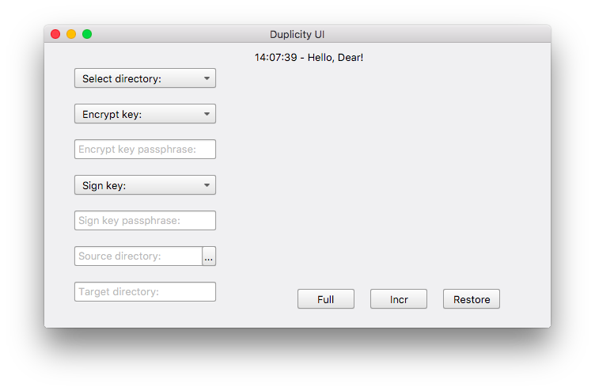
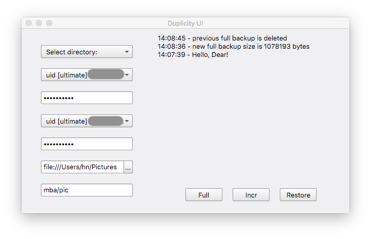

# Duplicity-UI

## Intro

Duplicity-UI is a small UI application with less than 1MB size, used by myself for doing backup to Google Drive with Duplicity. The application itself doesn't include **duplicity**, **pydrive** or **GPG** so make sure these applications are already installed. You can check this [post](https://redplus.me/post/using-duplicity-with-google-drive-for-backup-on-macos/) for how to install pydrive and duplicity on macOS.

The program will store input information to a **handle.json** file in the current working directory for later use so you don't need to input once again. Because the information is stored in plain text without encryption, you may **NOT** want to use your current gpg keys for encryption and signing.

Whenever a full backup is performed, all backup files before this full backup will be deleted. Currently one handle.json only holds configuration of one folder. So I recommend to run this application in the directory you want to backup so you can have each directory with a corresponding handle.json file.

This program is only tested on macOS 10.13.4 with LLVM 6.0, Boost 1.67 and Qt 5.10.1, and depends on Boost and Qt libraries only. It should work on WINDOWS as well but not tested.

## TODO: Asynchronous backup process for different folders

## Screenshots






## FAQ

**What does "Class FIFinderSyncExtensionHost is implemented in both /System/Library/PrivateFrameworks/FinderKit.framework/Versions/A/FinderKit (0x7fffb4de2c90) and /System/Library/PrivateFrameworks/FileProvider.framework/OverrideBundles/FinderSyncCollaborationFileProviderOverride.bundle/Contents/MacOS/FinderSyncCollaborationFileProviderOverride (0x113dedcd8). One of the two will be used. Which one is undefined." mean?**

As far as I know it's a macOS High Sierra issue, but it doesn't impact on the application.

## License

```
This program is free software: you can redistribute it and/or modify
it under the terms of the GNU General Public License as published by
the Free Software Foundation, either version 3 of the License, or
(at your option) any later version.

This program is distributed in the hope that it will be useful,
but WITHOUT ANY WARRANTY; without even the implied warranty of
MERCHANTABILITY or FITNESS FOR A PARTICULAR PURPOSE.  See the
GNU General Public License for more details.

You should have received a copy of the GNU General Public License
along with this program. If not, see <http://www.gnu.org/licenses/>.
```